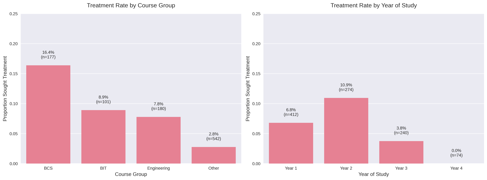

# Mental Health Data Analysis



## Overview
This repository contains a comprehensive analysis of mental health data among university students. The project focuses on understanding the factors influencing students' decisions to seek mental health treatment, with a particular emphasis on academic and demographic variables.

## Project Description
The analysis examines the relationship between various factors (such as course of study, year of study, academic performance, and mental health indicators) and students' likelihood of seeking mental health treatment. The project includes data cleaning, exploratory data analysis, statistical testing, and visualization components.

## Key Findings

### Significant Predictors of Seeking Treatment
- **Course of Study**: BCS students showed the highest treatment-seeking rate (16.4%), followed by BIT (8.9%) and Engineering (7.8%)
- **Year of Study**: Second-year students had the highest treatment rate (11.0%), while no fourth-year students reported seeking treatment
- **Mental Health Support**: Strong correlation with seeking specialist treatment

### Data Quality
- 1,000 total records analyzed
- No missing values in the dataset
- 16 variables examined

## Dependencies

### Core Libraries
- Python 3.8+
- pandas
- NumPy
- SciPy
- Matplotlib
- Seaborn
- scikit-learn

### Installation
```bash
# Clone the repository
git clone https://github.com/EzM-dot/Mental-Health-Data-Analysis.git

# Navigate to the project directory
cd Mental-Health-Data-Analysis

# Create and activate a virtual environment
python -m venv venv
source venv/bin/activate  # On Windows use `venv\Scripts\activate`

# Install dependencies
pip install -r requirements.txt
```

## Usage

### Running the Analysis
```bash
# Run the main analysis script
python run_analysis.py

# Generate visualizations
python visualize_results.py
```

### Output
- Statistical analysis results in the console
- Visualization files (e.g., `treatment_analysis.png`)
- Processed data files

## Files in the Repository

### Main Scripts
- `run_analysis.py`: Main script for data analysis
- `visualize_results.py`: Script for generating visualizations
- `Automating_Bivariate_Statistics.ipynb`: Jupyter notebook with exploratory analysis

### Data Files
- `mentalhealth-Solomon_Hutching.csv`: Primary dataset
- `BIVARIATE STATISTICS WITH DEPRESSION AS TARGET.xls`: Additional analysis

### Output
- `treatment_analysis.png`: Generated visualization of key findings

## Expected Results
After running the analysis, you can expect to see:
1. Statistical summaries of the relationships between variables
2. Visualizations showing treatment rates across different student groups
3. Identification of significant predictors of mental health treatment seeking
4. Insights into how academic factors relate to mental health service utilization

## Contributing
Contributions are welcome! Please feel free to submit a Pull Request.

## License
This project is licensed under the MIT License - see the [LICENSE](LICENSE) file for details.
